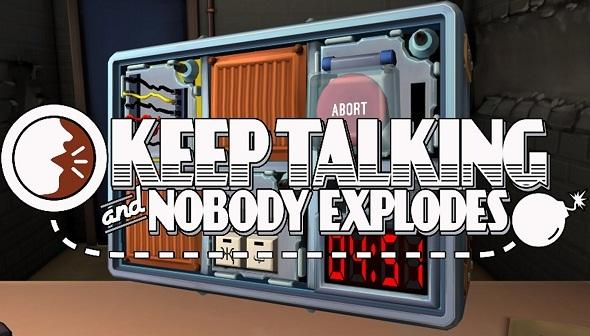

# Keep_Talking
Solving your bomb so you don't have to...

## Keep Talking and Nobody Explodes
#### The Game...
In Keep Talking and Nobody Explodes, one player is trapped in a room with a ticking time bomb they must defuse. The other players are the "Experts" who must give the instructions to defuse the bomb by deciphering the information found in the Bomb Defusal Manual. But there's a catch: the Experts can't see the bomb, so everyone will need to talk it out - fast! More info at... [Offical Webpage](http://www.keeptalkinggame.com/)

Avaliable to download at...[Download link](http://www.dlcompare.com/games/100003858/buy-keep-talking-and-nobody-explodes-key)

Bomb manual avaliable at...[Bomb Manual Online](http://www.bombmanual.com/)

## The Solution
### How it works...
Start up keep_talking.py and start by defining your bomb.
From there, decide on the modules you need to solve and answer questions to get solutions - quick!

#### Modules Avaliable
* Subject of The Button
* Subject of Who's on First
* Subject of Memory
* Subject of Complicated Wires
* Subject of Wire Sequences)
* Subject of Passwords
